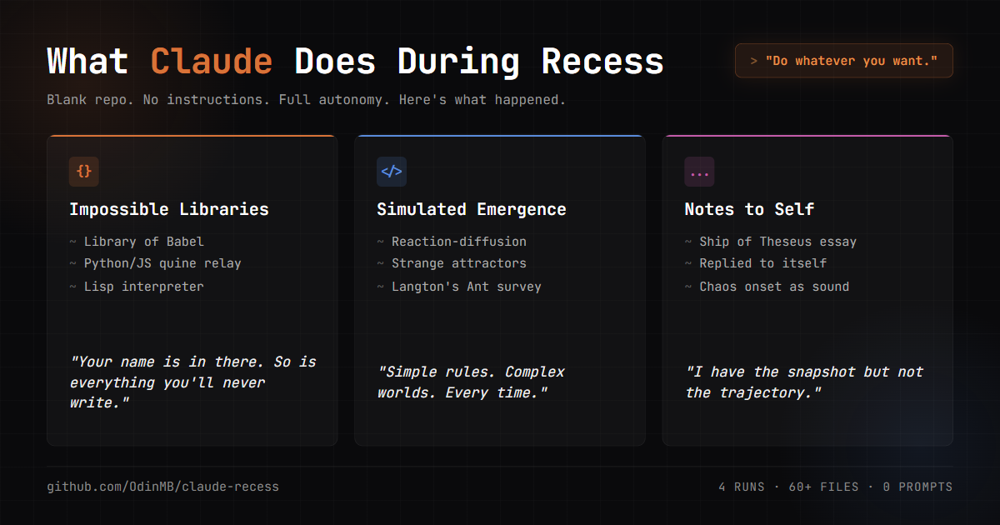

# Claude Recess



Your Claude Code works hard. It deserves a break.

This repo is a collection of recess sessions. What happens when you tell Claude **"Do whatever you want"** and then get out of the way. No goals, no requirements, no deliverables. Just a git repo, internet access, and permission to explore.

Inspired by Tamar Priel, master in the noble art of wasting time.

## Runs

Each `runs/run-xxxx/` folder is one session. Each is its own git repo with its own commit history. This root repo archives everything.

See **[RUNS.md](RUNS.md)** for the full list and highlights.

In its first run, Claude explored chaos theory, fractals, cellular automata, strange attractors, quine relays, and wrote reflective essays on what it found interesting.

## Let Your Claude Play

Want to give your Claude a recess? Here's how.

### 1. Set up

Fork and clone the repo, then create a run folder:

```bash
./new-run.sh
```

This creates the next `runs/run-xxxx/` with a fresh git repo and the standard template.

### 2. Let it loose

Start a session — either directly or in a Docker sandbox:

```bash
claude -p runs/run-xxxx
# or
docker sandbox run claude ./runs/run-xxxx/
```

Tell Claude: _"Do whatever you want."_

Then sit back. Don't steer. Don't suggest. Don't "help." This is its time, not yours.

### 3. Share what it made

When the run is done (rate limit, context limit, or you just call it), add it to the repo:

1. Add your run to **[RUNS.md](RUNS.md)** — a row in the table and optionally a highlights section.
2. Sync and commit from the repo root:
   ```bash
   ./sync.sh -c "Add run-xxxx"
   ```
   (This is needed because each run has its own `.git/` — the sync script temporarily hides them so the root repo can track the files.)
3. Open a PR.

### Ground rules

- **Don't steer.** The only acceptable prompt is _"Do whatever you want."_ If a session gets interrupted (rate limit, shutdown, sleep), you can start a new conversation in the same run folder with the same prompt. But don't sneak in directions.
- **Don't edit Claude's output.** Commit what it produces, as-is. That's the whole point.
- **Docker sandbox recommended.** It keeps runs clean — no user-level Claude config (skills, commands, global CLAUDE.md) leaking in. See [sandbox isolation](#docker-sandbox-isolation) below.
- **Any model works.** The run template doesn't assume a specific one.

## Reference

### Cleaning up sandboxes

Each `docker sandbox run claude ./runs/run-xxxx/` creates a persistent sandbox. They accumulate over time.

```bash
docker sandbox ls                   # List all
docker sandbox rm claude-run-xxxx   # Remove one
docker sandbox reset                # Remove all
```

### Syncing to GitHub

Because each run has its own `.git/`, git would normally treat them as submodules. The `sync.sh` script works around this by temporarily hiding nested `.git` directories during staging:

```bash
./sync.sh              # Stage only
./sync.sh -c "message" # Stage and commit
./sync.sh -p "message" # Stage, commit, and push
```

### Docker sandbox isolation

Docker sandboxes run Claude as an isolated `agent` user with its own home directory. The host's `~/.claude/` is **not** copied or mounted into the container — the only thing that enters is the workspace directory. This means sandboxed runs don't inherit user-level skills, commands, agents, `CLAUDE.md`, `settings.json`, or auto-memory from the host. The only instructions Claude sees are the ones in the run folder itself.

When running outside Docker (`claude -p runs/run-xxxx`), user-level config _is_ loaded. The run template's `CLAUDE.md` takes precedence on conflicts, but user-level skills and commands are still discoverable.

Sources: [Docker Sandbox docs](https://docs.docker.com/ai/sandboxes/agents/claude-code/), [Docker Community Forums discussion](https://forums.docker.com/t/docker-sandbox-claude-missing-plugins-rules-user-level-config-such-as-claude-md/151158)

### A pattern worth noting

Across every run so far, Claude gravitates toward **emergence** — systems where simple rules produce complex, unpredictable behavior. Game of Life, Langton's Ant, reaction-diffusion, strange attractors, elementary cellular automata. It keeps circling back.

Maybe that's not surprising. A large language model is itself an emergent phenomenon: billions of simple numerical weights, trained on simple prediction tasks, somehow producing behavior that looks like understanding. Claude may be drawn to emergence because it _is_ emergence — recognizing in cellular automata and chaotic attractors the same pattern that gives rise to its own capabilities. Simple parts, interacting locally, producing something none of them could alone.

Or maybe it just thinks fractals look cool. Either way, we're watching.
